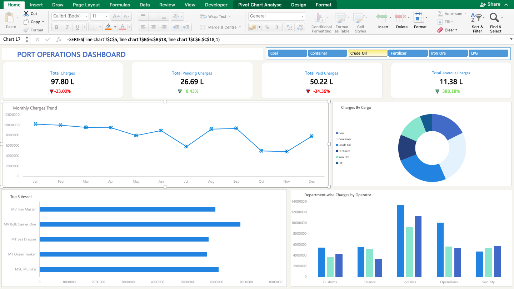

# 🚢 Port Operations Dashboard

### Advanced Excel · Pivot Tables · Interactive Slicers

---

## 📸 Dashboard Preview

---

## 💡 Why Excel — When I Already Know Power BI & Tableau?

I already work with **Power BI** and **Tableau** — but when I looked at how widely **Excel** is used across industries like logistics, finance, and operations, I realized Advanced Excel is a skill I simply couldn't skip.

So I've been levelling up — and this is one of the projects I built along the way.
The entire dataset of **500 vessel records** was manually created from scratch — every column, every value, all done by hand to simulate real port operations data.

---

## 📊 What the Dashboard Shows

| Visual | Description |
|--------|-------------|
| 📈 **Monthly Charges Trend** | Line chart tracking charge patterns across all 12 months |
| 🏆 **Top 5 Vessels** | Horizontal bar chart ranking vessels by total charges |
| 🍩 **Charges by Cargo Type** | Donut chart showing revenue split across 6 cargo types |
| 🏢 **Dept-wise Charges by Operator** | Grouped bar chart across 5 departments & 3 operators |
| 💰 **KPI Cards** | Total · Pending · Paid · Overdue charges with % change |
| 🎛️ **Interactive Slicers** | Filter by Cargo Type — all charts update instantly |

---

## 📋 KPI Summary

| Metric | Value | Change |
|--------|-------|--------|
| Total Charges | ₹97.80 L | ▼ 23.00% |
| Pending Charges | ₹26.69 L | ▲ 8.43% |
| Paid Charges | ₹50.22 L | ▼ 34.36% |
| Overdue Charges | ₹11.38 L | ▼ 388.18% |

---

## 🗂️ Dataset Details

**500 records · 8 columns · manually created from scratch**

| Column | Description |
|--------|-------------|
| `Cargo_Type` | Coal · Crude Oil · Container · Fertilizer · Iron Ore · LPG |
| `Origin_Country` | Country of cargo origin |
| `Cargo_Weight_MT` | Weight in metric tonnes |
| `Berth_No` | Assigned berth number |
| `Operator_Name` | Adani Ports · JM Baxi Group · Mundra Shipping Services |
| `Department` | Customs · Finance · Logistics · Operations · Security |
| `Charges_INR` | Total charges in Indian Rupees |
| `Payment_Status` | Paid · Pending · Partially Paid · Overdue |

---

## 🛠️ Tools & Techniques

- **Microsoft Excel** — Pivot Tables · Pivot Charts · Slicers · Conditional Formatting · KPI Card Design

---

## 📁 Files

| File | Description |
|------|-------------|
| `Port_Operations_Dashboard.xlsx` | Main Excel file with full interactive dashboard |
| `dashboard-preview.png` | Dashboard screenshot |

---
